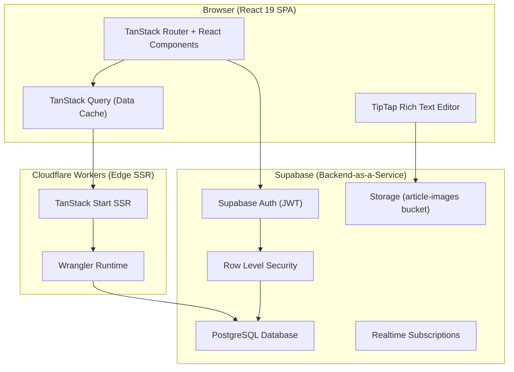
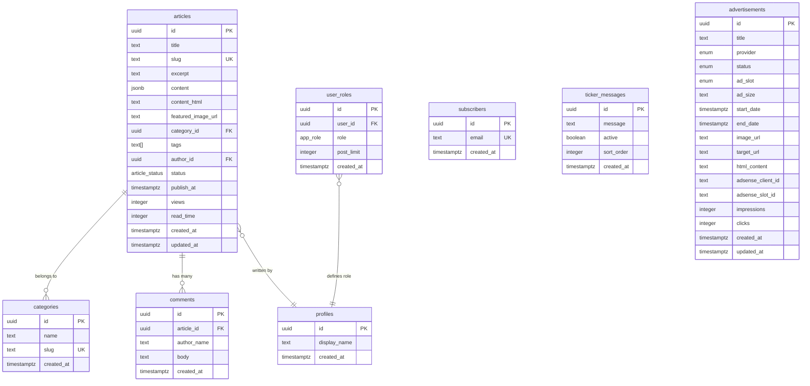

<p align="center">
  
</p>

<h1 align="center">The 24 European News</h1>

<p align="center">
  <strong>A premium, full-stack digital news platform with a cinematic editorial design, real-time CMS, role-based administration, and edge deployment on Cloudflare Workers.</strong>
</p>

<p align="center">
  
  
  
  
  
  
</p>

---

## Table of Contents

- [Overview](#overview)
- [Live Architecture Diagram](#live-architecture-diagram)
- [Tech Stack — Developer Reference](#tech-stack--developer-reference)
  - [Core Framework](#core-framework)
  - [Frontend](#frontend)
  - [Backend & Database](#backend--database)
  - [Deployment & Edge Runtime](#deployment--edge-runtime)
  - [Rich Text Editing](#rich-text-editing)
  - [Dev Tooling](#dev-tooling)
- [Project Architecture](#project-architecture)
  - [Directory Structure](#directory-structure)
  - [Routing Architecture](#routing-architecture)
  - [Database Schema](#database-schema)
  - [Authentication & Authorization](#authentication--authorization)
  - [Row Level Security (RLS)](#row-level-security-rls)
- [Design System & Aesthetics](#design-system--aesthetics)
  - [Color Palette](#color-palette)
  - [Typography](#typography)
  - [Animations & Micro-Interactions](#animations--micro-interactions)
  - [Dark & Light Theme](#dark--light-theme)
- [SEO Implementation](#seo-implementation)
- [Getting Started — Developer Setup](#getting-started--developer-setup)
- [Environment Variables](#environment-variables)
- [Database Migrations](#database-migrations)
- [User Guide — Admin Dashboard](#user-guide--admin-dashboard)
  - [Accessing the Dashboard](#accessing-the-dashboard)
  - [Dashboard Overview](#dashboard-overview)
  - [Article Management](#article-management)
  - [Category Management](#category-management)
  - [User & Author Management](#user--author-management)
  - [Ticker Management](#ticker-management)
  - [Subscriber Management](#subscriber-management)
  - [Advertisement Management](#advertisement-management)
- [User Guide — Author Dashboard](#user-guide--author-dashboard)
- [User Guide — Public Website](#user-guide--public-website)
- [Ad Slot Placement Guide](#ad-slot-placement-guide)
- [Performance & Optimization](#performance--optimization)
- [Administration](#administration)
- [License](#license)

---

## Overview

**The 24 European News** is a world-class digital news publication platform built for premium editorial content delivery. The platform combines a cinematic, luxury-tier frontend design with a powerful, role-based content management system — all deployed at the edge on Cloudflare Workers for sub-50ms global response times.

### Key Highlights

| Feature | Description |
|---|---|
| **Cinematic UI** | Glassmorphism, gold-accent design system, particle backgrounds, 3D card animations, and premium typography |
| **Full CMS** | Rich text editor (TipTap), image uploads, article scheduling, status workflows, category management |
| **Role-Based Access** | Three-tier system — `admin`, `author`, `user` — with post limits and approval workflows |
| **Edge-First SSR** | Server-side rendered via TanStack Start on Cloudflare Workers; instant global load times |
| **Ad Management** | Full advertisement system with Google AdSense integration, custom ads, impression/click tracking |
| **Real-Time Features** | Breaking news ticker, newsletter subscriptions, live view counting, comments |
| **SEO Optimized** | Per-page meta tags, Open Graph, canonical URLs, semantic HTML, structured heading hierarchy |
| **Dual Theme** | Premium dark mode (deep navy + gold) and refined light mode (warm ivory + champagne gold) |

---

## Live Architecture Diagram



---

## Tech Stack — Developer Reference

### Core Framework

| Technology | Version | Purpose |
|---|---|---|
| **TanStack Start** | `1.167+` | Full-stack React meta-framework with SSR, file-based routing, and edge deployment support |
| **TanStack Router** | `1.168+` | Type-safe file-based routing with nested layouts, route-level code splitting, and `head()` metadata |
| **TanStack Query** | `5.83+` | Server-state management, caching, background refetching |
| **Vite** | `7.3+` | Build tool and dev server with HMR, automatic code splitting, and tree shaking |

### Frontend

| Technology | Version | Purpose |
|---|---|---|
| **React** | `19.2` | UI library with concurrent features, Suspense, and server components support |
| **TypeScript** | `5.8` | End-to-end type safety including database types auto-generated from Supabase |
| **Tailwind CSS** | `4.2` | Utility-first CSS with custom design tokens, OKLCH color space, `@theme` directives |
| **Radix UI** | Latest | Accessible, unstyled primitives for dialogs, dropdowns, accordions, tabs, etc. |
| **Lucide React** | `0.575` | Premium SVG icon library (575+ icons) |
| **Recharts** | `2.15` | Dashboard analytics charts (articles, views, subscribers) |
| **Sonner** | `2.0` | Toast notification system |
| **Embla Carousel** | `8.6` | Touch-friendly carousels for hero sections and article showcases |
| **TW Animate CSS** | `1.3` | Pre-built Tailwind animation utilities |

### Backend & Database

| Technology | Purpose |
|---|---|
| **Supabase** | Backend-as-a-Service: PostgreSQL database, authentication, storage, and realtime |
| **PostgreSQL** (via Supabase) | Primary database with UUID primary keys, JSONB content storage, full-text search |
| **Supabase Auth** | JWT-based authentication with email/password, session persistence, auto-refresh tokens |
| **Supabase Storage** | Object storage for article featured images (`article-images` bucket, publicly readable) |
| **Row Level Security (RLS)** | Fine-grained database access control — every table enforced at the database layer |
| **Zod** | Runtime schema validation for forms (article editor, contact form, login) |
| **React Hook Form** | Performant form state management with Zod resolvers |

### Deployment & Edge Runtime

| Technology | Purpose |
|---|---|
| **Cloudflare Workers** | Edge compute runtime — SSR runs in 300+ global data centers |
| **Wrangler** | Cloudflare's CLI for local development, deployment, and secret management |
| **@cloudflare/vite-plugin** | Vite integration for Cloudflare Workers builds with Node.js compatibility |

### Rich Text Editing

| Technology | Purpose |
|---|---|
| **TipTap** | Headless, extensible rich text editor built on ProseMirror |
| **@tiptap/starter-kit** | Core formatting: bold, italic, headings, lists, blockquotes, code blocks |
| **@tiptap/extension-link** | Inline link insertion and editing |
| **ProseMirror** | Document model and transaction system underlying TipTap |

### Dev Tooling

| Tool | Purpose |
|---|---|
| **Bun** | Package manager and runtime (lockfile: `bun.lock`) |
| **ESLint 9** | Linting with React Hooks, React Refresh, and Prettier integration |
| **Prettier** | Code formatting |
| **TypeScript ESLint** | Type-aware linting rules |

---

## Project Architecture

### Directory Structure

```
luminapost-elite-main/
├── public/                          # Static assets (logos, favicons)
│   ├── logo.png                     # Dark theme logo
│   └── white-theme-logo.png         # Light theme logo
├── src/
│   ├── components/                  # Reusable React components
│   │   ├── ui/                      # 46 Radix UI primitives (shadcn/ui)
│   │   ├── Header.tsx               # Main navigation with mega-menu
│   │   ├── Footer.tsx               # 4-column premium footer with admin showcase
│   │   ├── AdminsShowcase.tsx       # Animated administration card (typewriter + 3D tilt)
│   │   ├── ArticleCard.tsx          # Reusable article preview card
│   │   ├── ArticleEditor.tsx        # TipTap-powered CMS article editor
│   │   ├── RichTextEditor.tsx       # TipTap configuration wrapper
│   │   ├── BreakingTicker.tsx       # Horizontal scrolling news ticker
│   │   ├── CardCarousel.tsx         # 3D card carousel for article showcases
│   │   ├── CommentsSection.tsx      # Public comments (no login required)
│   │   ├── ShareButtons.tsx         # Social sharing (Twitter, Facebook, LinkedIn, copy)
│   │   ├── NewsletterSignup.tsx     # Email subscription form
│   │   ├── AdSlot.tsx               # Dynamic ad placement component
│   │   ├── ParticlesBackground.tsx  # Ambient floating particles
│   │   └── ThemeToggle.tsx          # Dark/Light mode switcher
│   ├── hooks/
│   │   ├── useAuth.ts               # Authentication state + role detection
│   │   └── use-mobile.tsx           # Responsive breakpoint hook
│   ├── integrations/
│   │   └── supabase/
│   │       ├── client.ts            # Browser Supabase client (lazy-initialized Proxy)
│   │       ├── client.server.ts     # SSR Supabase client
│   │       ├── auth-middleware.ts   # Server-side auth verification
│   │       ├── auth-attacher.ts     # Request-level auth context
│   │       └── types.ts             # Auto-generated database TypeScript types
│   ├── lib/
│   │   ├── utils.ts                 # cn() utility (clsx + tailwind-merge)
│   │   ├── format.ts                # Date formatting, slugify, readTime helpers
│   │   ├── dummyData.ts             # Seed data for development/demo
│   │   ├── error-capture.ts         # Global error capture for SSR
│   │   └── error-page.ts            # Branded 500 error page HTML
│   ├── routes/                      # TanStack Router file-based routes
│   │   ├── __root.tsx               # Root layout (particles, header, footer, SEO)
│   │   ├── index.tsx                # Homepage (hero carousel, trending, sections)
│   │   ├── article.$slug.tsx        # Article detail page with related articles
│   │   ├── category.$slug.tsx       # Category listing page
│   │   ├── search.tsx               # Full-text search
│   │   ├── about.tsx                # About page
│   │   ├── contact.tsx              # Contact form
│   │   ├── services.tsx             # SEO services showcase (3D carousel, counters)
│   │   ├── login.tsx                # Authentication page
│   │   ├── privacy.tsx              # Privacy policy
│   │   ├── terms.tsx                # Terms & conditions
│   │   ├── admin.tsx                # Admin layout (sidebar, role-gated)
│   │   ├── admin.index.tsx          # Dashboard (stats, recent activity, seeding)
│   │   ├── admin.articles.tsx       # Article CRUD listing
│   │   ├── admin.articles.new.tsx   # New article editor
│   │   ├── admin.articles.$id.edit.tsx  # Edit existing article
│   │   ├── admin.categories.tsx     # Category management
│   │   ├── admin.ticker.tsx         # Breaking news ticker management
│   │   ├── admin.subscribers.tsx    # Newsletter subscriber list
│   │   ├── admin.users.tsx          # User/author creation and management
│   │   └── admin.ads.tsx            # Advertisement management system
│   ├── styles.css                   # Global design system (OKLCH tokens, animations)
│   ├── router.tsx                   # Router configuration
│   ├── routeTree.gen.ts             # Auto-generated route tree
│   ├── server.ts                    # Cloudflare Workers entry (SSR error handling)
│   └── start.ts                     # TanStack Start bootstrap
├── supabase/
│   ├── config.toml                  # Supabase project config
│   └── migrations/                  # SQL migration files (7 total)
│       ├── 20260524..._initial.sql  # Core schema (users, articles, categories, etc.)
│       ├── 20260524..._rls.sql      # Additional RLS policies
│       ├── 20260528_add_author_role.sql       # Author role + post limits
│       ├── 20260601_ad_management.sql         # Advertisements table
│       ├── 20260601_add_new_categories.sql    # Extended category list
│       └── 20260601_pending_review.sql        # Pending review workflow
├── vite.config.ts                   # Vite + TanStack Start + Cloudflare config
├── wrangler.jsonc                   # Cloudflare Workers configuration
├── tsconfig.json                    # TypeScript configuration
├── package.json                     # Dependencies and scripts
└── bun.lock                         # Bun lockfile
```

### Routing Architecture

The application uses **TanStack Router** with file-based routing. Routes are automatically code-split at the route level.

```
/                          → Homepage (hero, trending, category sections)
/article/:slug             → Article detail (full content, comments, sharing, related)
/category/:slug            → Category listing (filtered articles)
/search?q=                 → Full-text search results
/about                     → About page
/contact                   → Contact form
/services                  → SEO services showcase
/login                     → Authentication
/privacy                   → Privacy policy
/terms                     → Terms & conditions
/admin                     → Dashboard (role-gated)
/admin/articles            → Article CRUD
/admin/articles/new        → New article editor
/admin/articles/:id/edit   → Edit article
/admin/categories          → Category management
/admin/ticker              → Breaking news ticker
/admin/subscribers         → Newsletter subscribers
/admin/users               → User management (admin-only)
/admin/ads                 → Advertisement management (admin-only)
```

**Route Protection:** The `/admin` layout component checks authentication state via the `useAuth()` hook. Unauthenticated users are redirected to `/login`. Users without `admin` or `author` roles see an "Access Denied" screen. Admin-only pages (Users, Ads) check for `isAdmin` before rendering.

### Database Schema

The application uses **PostgreSQL** via Supabase with the following tables:



**Enums:**
- `app_role`: `admin` | `author` | `user`
- `article_status`: `draft` | `pending_review` | `published` | `scheduled`

### Authentication & Authorization

The platform implements a **three-tier role system**:

| Role | Capabilities |
|---|---|
| **Admin** | Full access: manage all articles, categories, users, ads, ticker, subscribers. Approve/reject author submissions. Create new admin/author accounts. |
| **Author** | Limited access: create and edit own articles only. Articles default to `pending_review` status. Subject to configurable post limits. |
| **User** | Public-facing only: browse articles, post comments, subscribe to newsletter. No dashboard access. |

**Auth Flow:**
1. User signs in via email/password on `/login`
2. Supabase Auth issues a JWT token stored in `localStorage`
3. `useAuth()` hook resolves the user's role from the `user_roles` table
4. The admin layout conditionally renders navigation based on role
5. RLS policies enforce access at the database layer (defense in depth)

### Row Level Security (RLS)

Every table has RLS enabled. Key policies:

| Table | Public | Authenticated | Admin |
|---|---|---|---|
| `articles` | Read published only | Authors read own | Full CRUD |
| `categories` | Read all | — | Full CRUD |
| `comments` | Read all, Insert | — | Delete |
| `subscribers` | Insert only | — | Read, Delete |
| `ticker_messages` | Read active only | — | Full CRUD |
| `user_roles` | — | Read own | Full CRUD |
| `advertisements` | — | — | Full CRUD |
| `storage:article-images` | Read all | — | Upload, Update, Delete |

---

## Design System & Aesthetics

### Color Palette

The design system uses the **OKLCH color space** for perceptually uniform color manipulation:

| Token | Dark Mode | Light Mode | Usage |
|---|---|---|---|
| `--navy` | `oklch(0.18 0.05 270)` | `oklch(0.22 0.09 270)` | Deep backgrounds, primary CTA |
| `--gold` | `oklch(0.78 0.13 85)` | `oklch(0.58 0.17 65)` | Accent, highlights, branding |
| `--silver` | `oklch(0.82 0.01 250)` | `oklch(0.42 0.03 250)` | Secondary text, borders |
| `--background` | Deep navy `oklch(0.12 0.03 270)` | Warm ivory `oklch(0.96 0.012 80)` | Page background |
| `--glass` | Navy at 45% opacity | White at 75% opacity | Glassmorphism cards |
| `--glass-border` | Silver at 18% opacity | Navy at 22% opacity | Card borders |

### Typography

| Font | Weight Range | Usage |
|---|---|---|
| **Playfair Display** (serif) | 500–800 | Headlines, article titles, brand identity (`font-display`) |
| **Inter** (sans-serif) | 400–700 | Body text, UI elements, navigation (`font-sans`) |

Both fonts are loaded from Google Fonts with `font-display: swap` for zero layout shift.

### Animations & Micro-Interactions

The platform features a comprehensive animation system:

| Animation | Duration | Usage |
|---|---|---|
| `fade-up` | 700ms | Section reveals on scroll |
| `fade-in` | 600ms | Component mounting transitions |
| `scale-in` | 500ms | Card entrance effects |
| `slide-down` | 500ms | Dropdown menus |
| `glow-pulse` | 3.2s | Gold highlight pulsing on featured elements |
| `ticker` | 40s | Continuous horizontal scroll for breaking news |
| `float-slow` | 8s | Ambient particle movement |
| `shimmer` | 3s | Loading skeleton shimmer |
| `tilt` | 6s | Subtle card tilt animation |
| `card-slide-3d` | Custom | 3D perspective card entrance for carousels |
| `name-sweep` | 2.2s | Luxury gold light sweep on admin names |
| `admins-blink` | 1s | Typewriter cursor blink |

**Premium Interactions:**
- **3D Card Tilt:** Mouse-tracking `perspective` + `rotateX/Y` on the admin showcase card
- **Animated Counters:** Intersection Observer-triggered count-up animations on the services page
- **Typewriter Effect:** Character-by-character typing with realistic speed variation for admin names
- **Gold Sweep:** One-shot luxury metallic reflection triggered after name typing completes
- **Particle System:** Canvas-based ambient floating particles with parallax depth

### Dark & Light Theme

Theme switching is handled via a CSS class toggle on the `<html>` element:

- **Dark Mode** (default): Deep navy backgrounds, silver text, gold accents, glassmorphism with dark glass, neon glow effects
- **Light Mode**: Warm ivory backgrounds, near-black navy text, burnished gold accents, soft shadows, premium editorial newspaper aesthetic

All components, including the Administration showcase card, automatically adapt to the active theme using CSS custom properties (`var(--color-*)`) rather than hardcoded RGBA values.

---

## SEO Implementation

### Per-Page Meta Tags

Every route defines a `head()` function providing:

```tsx
export const Route = createFileRoute("/")({
  head: () => ({
    meta: [
      { title: "The 24 European News — Premium News, Tech, Business & Lifestyle" },
      { name: "description", content: "Cinematic reporting on the stories shaping tomorrow." },
      { property: "og:title", content: "The 24 European News — Premium News & Culture" },
      { property: "og:description", content: "..." },
    ],
    links: [{ rel: "canonical", href: "/" }],
  }),
});
```

### SEO Checklist

| Feature | Status | Implementation |
|---|---|---|
| **Title Tags** | ✅ | Unique, descriptive titles per page via route `head()` |
| **Meta Descriptions** | ✅ | Compelling summaries on all public pages |
| **Open Graph** | ✅ | `og:title`, `og:description`, `og:type`, `og:site_name` |
| **Twitter Cards** | ✅ | `summary_large_image` card type |
| **Canonical URLs** | ✅ | `<link rel="canonical">` on homepage and article pages |
| **Semantic HTML** | ✅ | Proper `<main>`, `<article>`, `<nav>`, `<footer>`, `<header>` |
| **Heading Hierarchy** | ✅ | Single `<h1>` per page, logical `<h2>`-`<h6>` nesting |
| **Alt Text** | ✅ | All images include descriptive alt attributes |
| **Structured Data** | ✅ | Article metadata (author, date, read time, category) |
| **Admin Noindex** | ✅ | `<meta name="robots" content="noindex">` on all admin routes |
| **SSR** | ✅ | Full server-side rendering for search engine crawlability |
| **Performance** | ✅ | Edge deployment, code splitting, lazy loading, optimized bundles |
| **Mobile Responsive** | ✅ | Fully responsive design with mobile-first breakpoints |
| **Preconnect** | ✅ | `<link rel="preconnect">` for Google Fonts and Supabase |

### Article-Level SEO

Each article page dynamically generates:
- Title: `{article.title} — The 24 European News`
- Description: Article excerpt
- Canonical URL: `/article/{slug}`
- Structured metadata: author, publication date, read time, category

---

## Getting Started — Developer Setup

### Prerequisites

- **Bun** `1.0+` (package manager and runtime)
- **Node.js** `18+` (for Wrangler compatibility)
- **Supabase** account with a project created

### Installation

```bash
# Clone the repository
git clone https://github.com/your-org/the-24-european-news.git
cd the-24-european-news

# Install dependencies
bun install

# Start development server
bun run dev
```

The dev server starts at `http://localhost:5173` with full HMR support.

### Available Scripts

| Script | Command | Description |
|---|---|---|
| `dev` | `bun run dev` | Start Vite dev server with HMR |
| `build` | `bun run build` | Production build (client + SSR bundles) |
| `build:dev` | `bun run build:dev` | Development build for debugging |
| `preview` | `bun run preview` | Preview production build locally |
| `lint` | `bun run lint` | Run ESLint |
| `format` | `bun run format` | Format code with Prettier |

### Deploying to Cloudflare Workers

```bash
# Build production bundles
bun run build

# Deploy via Wrangler
npx wrangler deploy
```

---

## Environment Variables

Create a `.env` file in the project root:

```env
# Supabase Configuration (required)
VITE_SUPABASE_URL=https://your-project.supabase.co
VITE_SUPABASE_PUBLISHABLE_KEY=eyJhbGciOi...

# Server-side (for SSR)
SUPABASE_URL=https://your-project.supabase.co
SUPABASE_PUBLISHABLE_KEY=eyJhbGciOi...
```

> **Note:** The `VITE_` prefix exposes variables to the client bundle. The non-prefixed versions are used during server-side rendering on Cloudflare Workers.

---

## Database Migrations

Migrations are stored in `supabase/migrations/` and run in chronological order:

| Migration | Description |
|---|---|
| `20260524_initial` | Core schema: users, profiles, articles, categories, comments, ticker, subscribers, storage bucket, RLS policies |
| `20260524_rls` | Additional RLS policies and security functions |
| `20260524_seed` | Initial category and data seeding |
| `20260528_add_author_role` | Author role enum value, post limit column, author-specific RLS policies |
| `20260601_ad_management` | Advertisements table with provider types, slot positions, impression/click tracking |
| `20260601_add_categories` | Extended category list (International News, Health, Politics, Entertainment, Pet News) |
| `20260601_pending_review` | `pending_review` status for article approval workflow |

To apply migrations to a new Supabase project:

```bash
supabase db push
```

---

## User Guide — Admin Dashboard

### Accessing the Dashboard

1. Navigate to `/login`
2. Sign in with your admin credentials
3. You'll be redirected to `/admin`

> **First-time setup:** Use the Supabase SQL Editor to insert an admin role for your user:
> ```sql
> INSERT INTO user_roles (user_id, role)
> VALUES ('your-auth-user-uuid', 'admin');
> ```

### Dashboard Overview

The admin dashboard (`/admin`) displays at-a-glance metrics:

| Card | Description |
|---|---|
| **Articles** | Total article count across all statuses |
| **Categories** | Number of content categories |
| **Total Views** | Cumulative article view count |
| **Subscribers** | Newsletter subscriber count |
| **Pending Review** | Articles awaiting admin approval (admin-only) |

Below the stats, a **Recent Activity** list shows the 5 most recently updated articles with their current status (Published, Draft, Pending Review, Scheduled).

**Seed Data:** Click the "Seed Dummy Articles" button to populate the database with sample articles across all categories. This creates 10 categories and inserts pre-written articles for development and demo purposes.

### Article Management

**Location:** `/admin/articles`

| Action | Description |
|---|---|
| **Create** | Click "New article" → Opens the TipTap-powered rich text editor |
| **Edit** | Click the pencil icon on any article row |
| **Delete** | Click the trash icon (with confirmation) |
| **Status** | Visual badges: 🟢 Published, 🟡 Pending Review, 🔵 Scheduled, ⚪ Draft |
| **Approve** | Admin-only: Click ✅ to publish pending articles |
| **Reject** | Admin-only: Click ❌ to reject back to draft |

**Article Editor Fields:**

| Field | Required | Description |
|---|---|---|
| Title | ✅ | Article headline (auto-generates slug) |
| Slug | ✅ | URL-friendly identifier (editable) |
| Excerpt | ❌ | Short summary for cards and SEO descriptions |
| Featured Image | ❌ | URL to the hero image displayed on the article |
| Category | ❌ | Select from available categories |
| Tags | ❌ | Comma-separated tags for filtering |
| Status | ✅ | Draft, Published, Scheduled, or Pending Review |
| Publish Date | ❌ | Schedule future publication (ISO datetime) |
| Content | ✅ | Rich text editor with formatting toolbar |

**Rich Text Editor Capabilities:**
- Bold, Italic, Strikethrough
- Headings (H1–H6)
- Bullet lists, Ordered lists
- Blockquotes
- Code blocks
- Inline links
- Undo/Redo

### Category Management

**Location:** `/admin/categories`

Categories organize articles into navigable sections. Each category has:
- **Name**: Display name (e.g., "Tech & AI")
- **Slug**: URL path segment (e.g., "tech")

Default categories: Trending News, International News, Tech & AI, Business, Finance, Health, Politics, Entertainment, Lifestyle & Fashion, Pet News.

### User & Author Management

**Location:** `/admin/users` (admin-only)

| Feature | Description |
|---|---|
| **Create Author** | Create a new user with `author` role, set email/password/display name |
| **Create Admin** | Create a new admin user (full system access) |
| **Post Limits** | Set maximum article count per author (blank = unlimited) |
| **Role Badges** | 🛡️ Admin, ✏️ Author — visual role indicators |
| **Article Count** | Shows how many articles each author has published |
| **Delete User** | Remove user role (revokes dashboard access) |

**Author Workflow:**
1. Admin creates an author account with a post limit
2. Author signs in and accesses a limited dashboard (Articles only)
3. Author creates articles — status defaults to `pending_review`
4. Admin sees pending articles on their dashboard
5. Admin approves (publishes) or rejects (reverts to draft)
6. Author's article count is tracked against their post limit

### Ticker Management

**Location:** `/admin/ticker`

Manage the breaking news horizontal ticker that displays at the top of every public page:

| Feature | Description |
|---|---|
| **Add Message** | Create new ticker messages |
| **Toggle Active** | Enable/disable individual messages |
| **Sort Order** | Control display sequence |
| **Delete** | Remove messages |

### Subscriber Management

**Location:** `/admin/subscribers`

View all newsletter subscribers collected via the homepage signup form:

| Feature | Description |
|---|---|
| **View List** | See all subscribed email addresses with timestamps |
| **Delete** | Remove subscribers |

### Advertisement Management

**Location:** `/admin/ads` (admin-only)

A full-featured ad management system supporting multiple providers:

**Providers:**
| Provider | Description |
|---|---|
| **Google AdSense** | Paste your client ID and slot ID for automatic ad rendering |
| **Custom** | Upload custom banner images with target URLs |
| **Sponsored** | Sponsored content banners |
| **Other** | Generic HTML ad content |

**Ad Slots (6 positions):**

| Slot | Size | Placement |
|---|---|---|
| Header Banner | 970×90 | Top of every page, below the breaking ticker |
| Mid Page | 728×250 | Between content sections on the homepage |
| Sidebar | 300×600 | Article detail page sidebar |
| Footer Banner | 970×90 | Above footer navigation |
| Mid Article | 728×90 | Inserted mid-way through article content |
| End Article | 728×90 | After article content, before comments |

**Tracking:**
- **Impressions**: Auto-incremented each time an ad renders on screen
- **Clicks**: Tracked when a user clicks the ad
- **CTR**: Calculated as `clicks / impressions × 100`
- **Date Range**: Configurable start/end dates for campaign scheduling

---

## User Guide — Author Dashboard

Authors have a streamlined dashboard with limited access:

### What Authors Can Do

| Feature | Access |
|---|---|
| View dashboard stats | ✅ (own articles only) |
| Create new articles | ✅ (within post limit) |
| Edit own articles | ✅ |
| Delete own articles | ❌ |
| Manage categories | ❌ |
| Manage users | ❌ |
| Manage ads | ❌ |
| Manage ticker | ❌ |
| View subscribers | ❌ |

### Author Article Workflow

1. Navigate to `/admin/articles`
2. Click "New article" to open the editor
3. Fill in the title, content, category, and excerpt
4. Set status to "Pending Review" (required for author submissions)
5. Click "Save"
6. Wait for admin approval — once approved, the article goes live

> **Post Limits:** If your admin has set a post limit and you've reached it, you'll need to contact the admin for an increase.

---

## User Guide — Public Website

### Homepage

The homepage features:
- **Hero Carousel**: Auto-rotating showcase of the 5 most recent articles with large featured images, titles, and excerpts. Manual navigation via arrow buttons and dot indicators.
- **Trending Section**: Top 5 articles sorted by view count.
- **Category Sections**: Articles grouped by category (News, Tech & AI, Business, Finance, Lifestyle, Pet News) with "View all" links.
- **Newsletter Signup**: Email subscription form.
- **Ad Slots**: Header banner, mid-page, sidebar, and footer banner positions.

### Article Pages

Each article (`/article/:slug`) provides:
- Full-width featured image
- Article title, author, publication date, read time
- Rich HTML content rendered from the editor
- Social share buttons (Twitter, Facebook, LinkedIn, copy link)
- Comments section (no login required — enter name and comment)
- Related articles carousel (same category)
- Ad slots (mid-article, end-article)

### Search

Navigate to `/search?q=your+query` or use the search icon in the header. Results show matching articles with title, excerpt, category, and publication date.

### Categories

Click any category in the navigation or footer to view `/category/:slug` with all published articles in that category.

### Theme Toggle

Click the sun/moon icon in the header to switch between Dark Mode and Light Mode. The preference is applied instantly across all components.

---

## Ad Slot Placement Guide

For publishers configuring advertisements:

```
┌──────────────────────────────────────────────────────┐
│ [BREAKING TICKER]                                     │
├──────────────────────────────────────────────────────┤
│ [HEADER]                                              │
├──────────────────────────────────────────────────────┤
│ ▓▓▓▓▓▓▓▓▓ HEADER BANNER AD (970×90) ▓▓▓▓▓▓▓▓▓▓▓   │
├──────────────────────────────────────────────────────┤
│                                                       │
│              HERO CAROUSEL                            │
│                                                       │
├──────────────────────────────────────────────────────┤
│ ▓▓▓▓▓▓▓▓▓ MID PAGE AD (728×250) ▓▓▓▓▓▓▓▓▓▓▓▓▓▓   │
├──────────────────────────────────────────────────────┤
│                                                       │
│        TRENDING + CATEGORY SECTIONS                   │
│                                                       │
├──────────────────────────────────────────────────────┤
│ ▓▓▓▓▓▓▓▓▓ FOOTER BANNER AD (970×90) ▓▓▓▓▓▓▓▓▓▓▓   │
├──────────────────────────────────────────────────────┤
│ [FOOTER]                                              │
└──────────────────────────────────────────────────────┘
```

**Article Detail Page:**

```
┌──────────────────────────────────────────────────────┐
│ ARTICLE TITLE                                         │
│ Author · Date · Read Time                             │
│                                                       │
│ Featured Image                                        │
│                                                       │
│ Content paragraph 1...                                │
│ Content paragraph 2...                                │
│                                                       │
│ ▓▓▓▓▓▓▓▓ MID ARTICLE AD (728×90) ▓▓▓▓▓▓▓▓▓▓▓▓▓   │
│                                                       │
│ Content paragraph 3...                                │
│ Content paragraph 4...                                │
│                                                       │
│ ▓▓▓▓▓▓▓▓ END ARTICLE AD (728×90) ▓▓▓▓▓▓▓▓▓▓▓▓▓   │
│                                                       │
│ [SHARE BUTTONS]                                       │
│ [COMMENTS SECTION]                                    │
│ [RELATED ARTICLES]                                    │
└──────────────────────────────────────────────────────┘
```

---

## Performance & Optimization

### Build Optimization

The Vite build configuration includes intelligent **manual chunk splitting**:

| Chunk | Contents | Typical Size (gzip) |
|---|---|---|
| `supabase` | `@supabase/supabase-js` | ~55 KB |
| `tiptap` | TipTap + ProseMirror (editor) | ~125 KB |
| `lucide` | Lucide icon library | ~9 KB |
| `index` | Core React + TanStack | ~130 KB |
| Route chunks | Per-page code | 1–6 KB each |

### Performance Features

- **Edge SSR**: Server-side rendering on Cloudflare Workers (300+ global PoPs)
- **Route-Level Code Splitting**: Each page loads only the JavaScript it needs
- **Lazy Client Initialization**: Supabase client uses a `Proxy` for deferred initialization
- **Image Optimization**: Featured images served from Supabase Storage CDN
- **Font Preconnect**: `<link rel="preconnect">` for Google Fonts eliminates DNS lookup latency
- **CSS in OKLCH**: Perceptually uniform colors computed efficiently by the browser

---

## Administration

### Website Administrators

| Name | Role | Status |
|---|---|---|
| **Dr Rizwan Ahmad** | Founder & CEO | 🟢 Online |
| **Hina Rasheed** | Managing Editor | 🟡 Active |

The administration section is prominently featured in the website footer with a premium animated showcase including:
- Live status indicators
- Typewriter name animation with luxury gold sweep effect
- 3D perspective hover tilt
- Glassmorphism card with ambient particle effects
- Full dark/light theme adaptation

---

## License

© 2026 The 24 European News. All rights reserved.

This project is proprietary software. Unauthorized copying, modification, distribution, or use of this software is strictly prohibited without explicit written permission from the administration.

---

<p align="center">
  <sub>Built with ❤️ by the team at <strong>The 24 European News</strong></sub>
</p>
